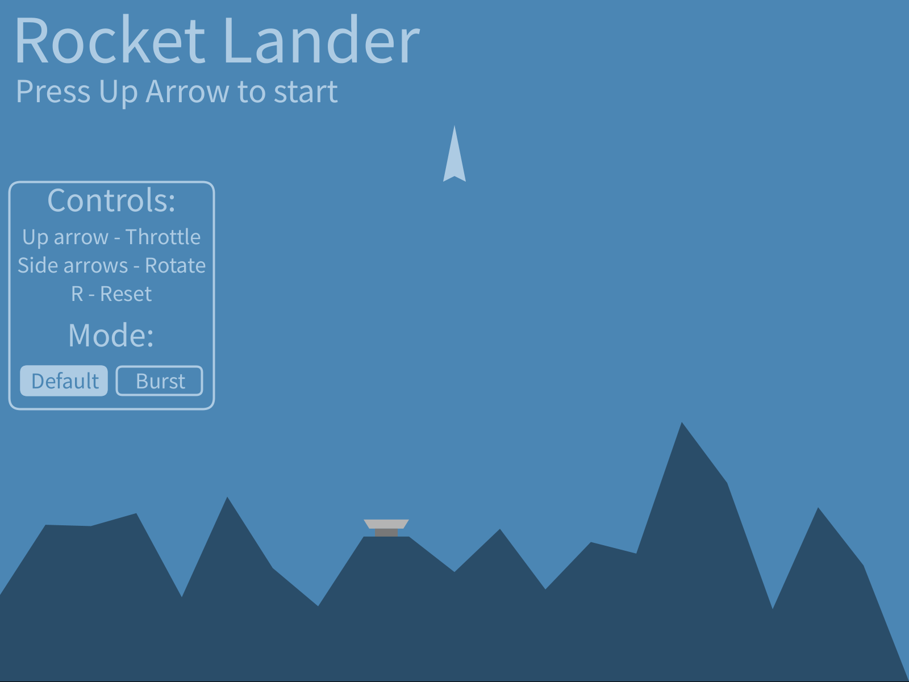

# Rocket-Landing-Game
A personal project created in Processing 4, started to test my game design and programming skills where I couldn’t rely on an out-of-the-box game engine, 
instead needing to design all the basic physics calculations, visuals, animations and game states myself.

